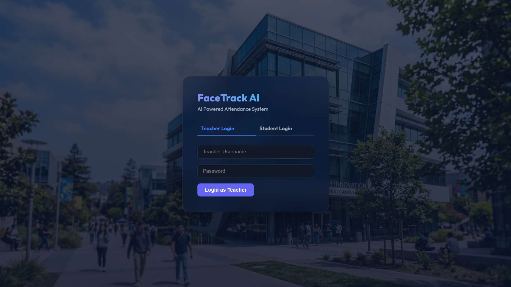
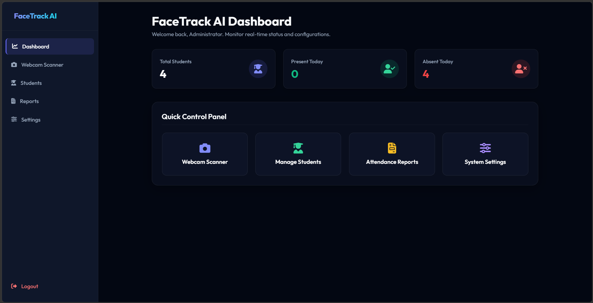

# 📷 Recogny AI: Hybrid Face Recognition Attendance Management System





Recogny AI is an enterprise-ready, hybrid edge-cloud attendance management system. The application leverages **local edge-computing** for sub-second facial recognition (running deep-learning models locally on ONNX runtime) and synchronizes registrations, logs, and sheets to **Amazon Web Services (S3 and DynamoDB)**. 

Featuring a modern dark-glassmorphism dashboard, it supports secure roles for both teachers (system kiosks, student directories, configuration settings, PDF reporting) and students (personal portal logs).

---

## 🏗️ System Architecture

To avoid expensive cloud-computing API costs and handle strict IAM restrictions, the system utilizes a **Hybrid Edge-Cloud Topology**:

```
                       ┌──────────────────────┐
                       │   Kiosk Web Client   │
                       └──────────┬───────────┘
                                  │ (Webcam Frame Grab)
                                  ▼
                       ┌──────────────────────┐
                       │  Flask Web Service   │
                       └────┬────────────┬────┘
      (Edge Compute)        │            │        (Cloud Sync)
     ┌──────────────────────┘            └──────────────────────┐
     ▼                                                          ▼
┌──────────────┐                                        ┌───────────────┐
│ OpenCV DNN   ├─► Face Detection (YuNet)               │ Amazon S3     │
│ Pipeline     ├─► Vector Embeddings (SFace)            │ (Photo Assets)│
└──────────────┘                                        └───────┬───────┘
                                                                │
                                                                ▼
                                                        ┌───────────────┐
                                                        │ Amazon        │
                                                        │ DynamoDB      │
                                                        │ (Data Schema) │
                                                        └───────────────┘
```

1. **Edge-Compute Recognition Pipeline**: The web browser grabs frames from the camera kiosk and streams them to the local Flask backend. The server processes frames using **OpenCV's DNN engine** running **YuNet** (face detection) and **SFace** (face feature embedding extraction) locally on ONNX runtime, evaluating similarity via Cosine Similarity calculations.
2. **Cloud Storage & Sync**: When a student registration or attendance scan is verified, student metadata is stored in **Amazon DynamoDB**, and photo assets are securely stored in **Amazon S3**.
3. **Graceful Offline Fallback**: If AWS connections are unavailable, the system automatically falls back to a local **SQLite** database configuration, allowing offline operation.

---

## 🛠️ Infrastructure Component Breakdown

| Service / Tool | Tech Component | Functional Role |
| :--- | :--- | :--- |
| **OpenCV YuNet** | Local DNN | Localizes face bounding boxes in the live video stream. |
| **OpenCV SFace** | Local DNN | Aligns face crops and extracts 128-dimensional mathematical embeddings. |
| **Amazon DynamoDB** | AWS NoSQL | Persists student metadata and logs in tables (`Students` and `Attendance`). |
| **Amazon S3** | AWS Object Store | Securely stores registered student portrait photographs. |
| **Flask API** | Backend | Exposes RESTful endpoints, handles auth, and manages RBAC middleware. |
| **ReportLab** | PDF Engine | Generates print-ready attendance audit spreadsheets in-memory. |

---

## 🔒 Security & Access Controls

* **Role-Based Access Control (RBAC)**: Enforced via Flask middleware. Students logging in via their Roll Number are strictly isolated to their student portal (`/student/portal`) and are blocked from dashboard analytics, webcam scanning, and directory updates.
* **Auto-Spoofing Defense**: The camera kiosk is restricted to teacher sessions only. Students cannot access the scanner link from home to spoof their location.
* **Database Integrity**: Roll numbers are verified at registration to prevent duplicates, and images are saved with unique UUID-based filenames to prevent collisions.

---

## 🚀 Setup & Installation

### 1. Clone the Repository
```bash
git clone https://github.com/your-username/Recogny-AI.git
cd Recogny-AI
```

### 2. Configure Local Virtual Environment
```bash
# Initialize sandbox
python -m venv venv

# Activate (Windows PowerShell)
.\venv\Scripts\Activate.ps1

# Install required packages
pip install -r requirements.txt
```

### 3. Setup AWS Configurations (Optional for Cloud Mode)
To run in cloud mode, verify your AWS CLI is configured (`aws configure`). Create a `.env` file in the root directory:
```env
SIMULATION_MODE=False
AWS_DEFAULT_REGION=ap-south-1
S3_BUCKET_NAME=your-s3-bucket-name
DYNAMODB_TABLE_STUDENTS=Students
DYNAMODB_TABLE_ATTENDANCE=Attendance
```
*Note: If no `.env` file is present, the system defaults automatically to Offline SQLite mode.*

### 4. Run the Application
```bash
python app.py
```
Open `http://localhost:5000` in your web browser. 

* **Default Admin Credentials**: Username: `admin` | Password: `admin123`
